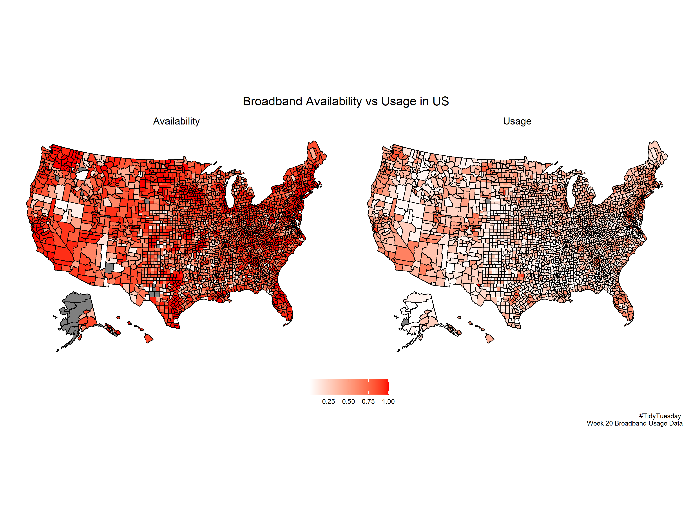

Overview
================
Pramod Surve
5/14/2021

## Week 20 Broadband Data

I created **choropleth map** with the data.

### Learnings

-   I have used the usmap library to create us map. However there are
    many more popular libraries to ceate US maps as noted in the
    reference section.

    -   It is important to create county\_ids by name fips or state
        codes by name state if you want to plot by state or counties.

-   The patchwork library requires **&** instead of **+** to specify the
    theme to put the legend in the correct position.

### Additional References

Here are some additional resources to create maps using R.

Other important library is **maps**. Some useful documentation can be
found over
[here.](https://www.rdocumentation.org/packages/maps/versions/3.3.0/topics/map)

Here is a [comprehensive
documentation](https://www.r-graph-gallery.com/choropleth-map.html) to
create choropleth maps.

[Geocomputation book](https://geocompr.robinlovelace.net/intro.html)
